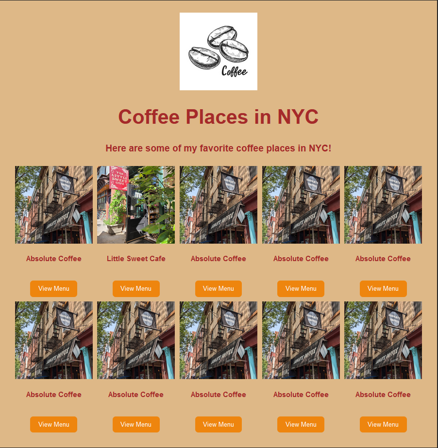

# Project Week 1 Web102 CodePath
### Project Description:
This Week I created a simple landing page for my favorite coffee shops in NYC. I created a Card component which hosts the name, image, description and link to the shop's online menu. Then each Card component populated in a Container component in rows.
You can run the project with npm run dev
This is the final landing page, with some placeholder data.

